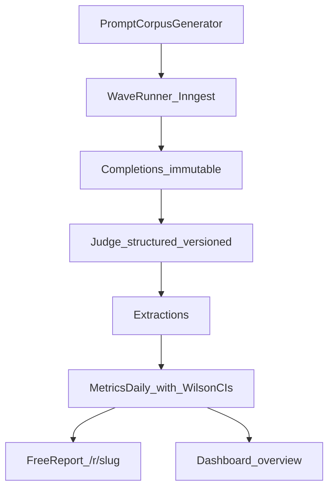
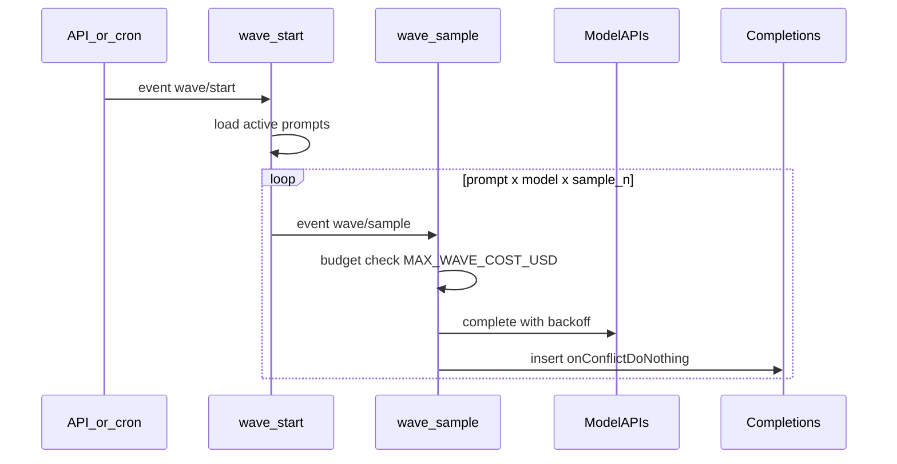
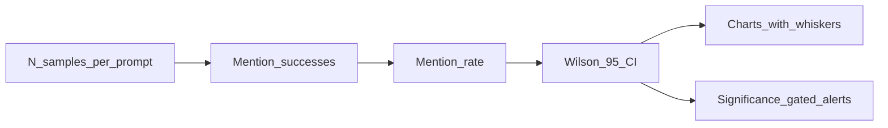
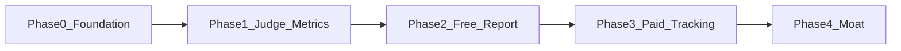

# AI Visibility Tracker (AVT)

Measure how brands appear in AI assistant answers — **ChatGPT, Claude, Gemini, Perplexity** — and track it over time with statistical rigor.

**Positioning:** the only AI visibility tracker with real methodology: multi-sample measurement, Wilson confidence intervals, and versioned extraction.

> Working codename **AVT**. Keep product branding independent of other portfolios.

**Live demo (local):**

```bash
pnpm install
cp .env.example .env.local
pnpm seed
pnpm dev
```

Then open:

- [http://localhost:3000](http://localhost:3000) — landing
- [http://localhost:3000/dashboard](http://localhost:3000/dashboard) — tracked demo dashboard (CI charts)
- [http://localhost:3000/report](http://localhost:3000/report) — free instant report
- [http://localhost:3000/r/demo-affirm-bnpl](http://localhost:3000/r/demo-affirm-bnpl) — sample shareable report

---

## Product surfaces

| Surface | Route | Purpose |
|---------|-------|---------|
| Free instant report | `/report` → `/r/[slug]` | PLG wedge — mini-wave, shareable URL + OG image |
| Paid-style dashboard | `/dashboard` | Timeseries, competitors, citations (demo fixtures) |

---

## Architecture



**Design principle:** the raw response store is the asset. Never mutate or delete completions. Metrics definitions will change; raw data lets you recompute history. Every extraction carries `judge_version`.

### Wave fan-out



---

## Sampling methodology

LLM answers are stochastic. One run per prompt is noise, not a metric.

| Parameter | Tracked wave | Free report |
|-----------|--------------|-------------|
| Prompts | ~100 | ~30 |
| Samples per prompt × model (N) | 8 | 4 |
| Models | 4 | 4 |
| Temperature | provider default (not forced to 0) | same |

**Mention rate** = fraction of samples in which the brand appears (alias-aware; judge is final authority).

**Confidence intervals:** Wilson 95% CI on every rate chart. Alerts fire only when a week-over-week change falls outside the CI — no significance, no alert.



Cost intuition (tracked brand, weekly): ~100 × 8 × 4 ≈ 3,200 completions + judge pass ≈ tens of dollars per category / month at scale — competitors are free (same completions, extract all brands).

---

## Data model

Core tables (Drizzle → Postgres / Supabase):

| Table | Role |
|-------|------|
| `categories` | Market segment (e.g. BNPL / US) |
| `brands` | Name + aliases + domain |
| `prompts` | Intent-typed buyer questions |
| `runs` | Wave execution + cost rollup |
| `completions` | **Immutable** raw text; unique `(run, prompt, model, sample_n)` |
| `extractions` | Versioned judge JSON |
| `metrics_daily` | Rolled-up rates + CIs + citation share |
| `workspaces` / `members` / `subscriptions` | Paid tenancy (schema ready) |
| `reports` | Shareable free-report snapshots |

Intent types: `category_query` · `comparison` · `best_for` · `alternative` · `trust` · `howto`

Unaided prompts (`category_query`, `best_for`, `howto`) must not name the tracked brand. Aided types may.

---

## Stack

| Layer | Choice |
|-------|--------|
| App | Next.js 15 App Router, TypeScript, Tailwind |
| DB | Postgres via Supabase + Drizzle ORM |
| Jobs | Inngest (`wave/start`, `wave/sample`) |
| Models | OpenAI, Anthropic, Gemini, Perplexity |
| Judge | Claude Haiku (fallback GPT-4o-mini) / heuristic in fixture mode |
| Charts | Recharts (CI error bars) |
| Validation | Zod |

Fixture mode (`FIXTURE_MODE=true` or missing API keys) runs the full UI and `pnpm wave:demo` without burning tokens.

---

## Local development

```bash
pnpm install
cp .env.example .env.local
# optional: set DATABASE_URL for real Postgres migrations
pnpm db:generate   # already committed under drizzle/
pnpm db:migrate    # requires DATABASE_URL
pnpm seed          # prints fixture summary; inserts if DB configured
pnpm test          # Wilson CI, judge schema, alias matching
pnpm wave:demo     # fan-out math + model clients in fixture mode
pnpm dev
```

### Environment

See [`.env.example`](.env.example) for:

- `DATABASE_URL`, Supabase keys
- `OPENAI_API_KEY`, `ANTHROPIC_API_KEY`, `GOOGLE_AI_API_KEY`, `PERPLEXITY_API_KEY`
- `INNGEST_EVENT_KEY`, `INNGEST_SIGNING_KEY`
- `MAX_WAVE_COST_USD` — hard budget kill-switch per wave
- `FIXTURE_MODE`

---

## Roadmap (from technical plan)



| Phase | Status in this repo |
|-------|---------------------|
| 0 Foundation — schema, clients, wave runner | Done (mini MVP) |
| 1 Judge + metrics + Wilson CIs | Done (heuristic + tests; live judge when keys present) |
| 2 Free instant report | Done (fixture mini-wave UI) |
| 3 Stripe, auth, digests, alerts | Schema stubs only |
| 4 Citation intel, leaderboards, embeds | Not started |

---

## Charts in the product

Dashboard and report pages render:

1. **Score timeseries** — visibility score (0–100) per model over weekly waves  
2. **Mention-rate bars** — rate × model with Wilson CI whiskers  
3. **Competitor overlay** — category share-of-voice style scores  
4. **Citation table** — domain frequency across answers  

---

## Engineering rules

1. `completions` is append-only. Never update raw text.
2. Changing the judge prompt ⇒ new `judge_version` + backfill job, never silent overwrite.
3. Wave fan-out is idempotent (`onConflictDoNothing` on unique sample key).
4. Log per-wave cost; honor `MAX_WAVE_COST_USD`.
5. Tests cover Wilson math, judge Zod schema, and alias matching (`pnpm test`).

---

## License / naming

Private product exploration under public source for now. Rename before launch; register a domain that does not collide with adjacent brands.
